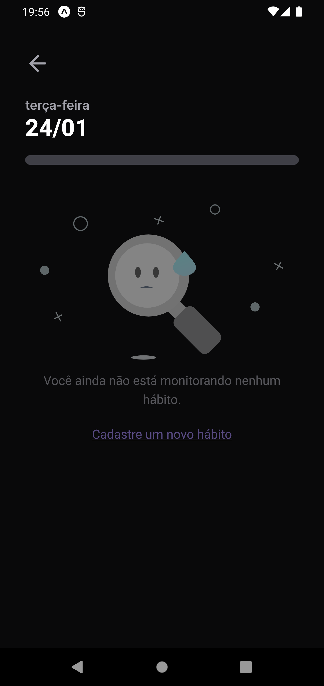
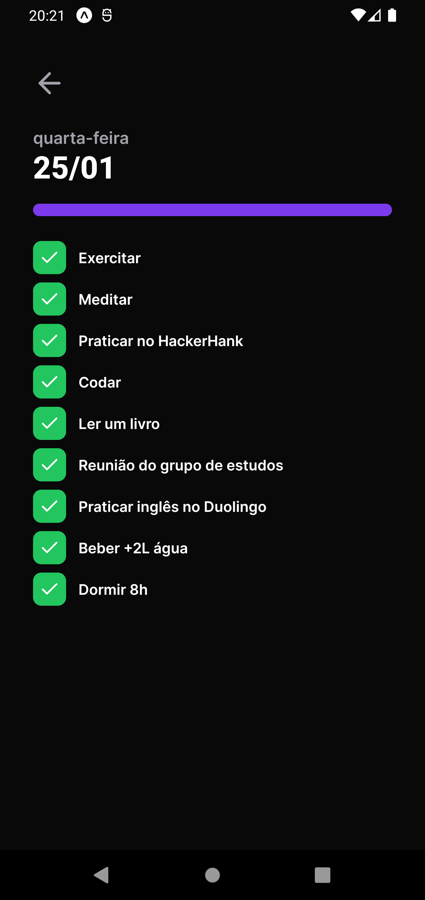
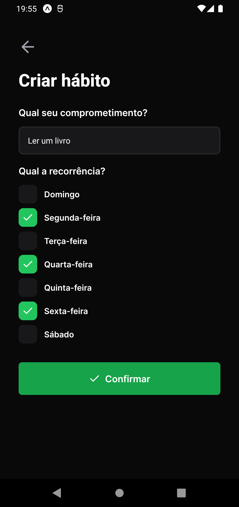

<p align="center">
  
</p>
<h3 align="center">
You are in control of your routine!
</h3>

<br><br>

<p align="center">
  
  
  
</p>
<br>

<p align="center">
  <a href="#about">About</a> •
  <a href="#habits">Habits</a> •
  <a href="#installation">installation</a> •
  <a href="#technology">technology</a> •
  <a href="#autor">Author</a>  
</p>

## About

Project developed during NLW Setup, an event created by Rocketseat. A 100% online and FREE event, with exclusive and UNPRECEDENTED content.

It took place from the 16th to the 20th of January 2023 and was intended to show in practice the power of the NodeJS + ReactJS + React Native stack and how these technologies can lead you to your biggest goals as a programmer.


## Habits

Habits is a daily task tracking app to help its users track their completed and unfulfilled activities.

The application flow is simple: the user registers the desired habits indicating which days of the week they should be performed and every day he will have a list of habits according to the current day, where he will indicate the status of each habit and the application will generate a daily progress that will be illustrated in the progress bar and also in the colors of the squares that represent the days where lighter colors represent greater numbers of complete habits.

The application has, in addition to the backend, a web and mobile application, which will be illustrated below.

### Habits - Mobile Application

The functionalities of the mobile application are the same as those of the web, so I will show the screens with less explanation to avoid redundancy and I will pay attention only to small details if they exist and are relevant to be mentioned.

Just like on the web, when accessing the application, the user will come across the 'little squares' that represent the days with colors based on their respective progress, as seen below:

|                           Splash Screen                           |                              Home empty                               |                       Home with progress                        |
| :---------------------------------------------------------------: | :-------------------------------------------------------------------: | :-------------------------------------------------------------: |
|  |  |  |

Unlike the web, when clicking on a day to see the details, we will not have a popover with its details, but a redirection to a screen where this information will be displayed. Below we will see the screens where we have a day without linked habits, a day with partially completed habits and a fully completed day, respectively:

|                               days without habits                                |                            day partially concluded                            |                           fully completed day                            |
| :--------------------------------------------------------------------------: | :------------------------------------------------------------------------------: | :---------------------------------------------------------------------------: |
|  |  |  |

On the Home screen and on the day screen without habits, we have a button and a link, respectively, which will direct us to the form for creating a new habit.
The necessary information is the same as on the web and below is the illustrated registration flow:

|                                 Form empty                                 |                           Form filled                            |                               completed registration                               |
| :------------------------------------------------------------------------: | :------------------------------------------------------------------: | :----------------------------------------------------------------------------: |
|  |  |  |

With that, we conclude our tour of the mobile application! 🙂
Just like on the web, I leave below a GIF navigating through the application and going through all its flows and also the demonstration of the animations present in the App:

<div  align="center">

</div>

### 📱 App Running (Mobile)

```bash
# Clone this repository
$ git clone git@github.com:glendson/mobile-habits.git
# Access project folder in terminal/cmd
$ cd mobile-habits
# install the dependencies
$ npm install
# If you prefer to use Yarn, run the command below
$ yarn
# run the application
$ yarn start
# The Expo menu will open in the terminal where you can scan the QR Code to run the app directly on your cell phone or the options to run it on the android or iOS emulator.
```

## Technology


<br><br><br><br>


## Author

<div align="center">

<h1>Glendson Garcete</h1>
<strong>FullStack Developer</strong>
<br/>
<br/>

<a href="https://www.linkedin.com/in/glendson-zeus-tomazetto-garcete-a2a0b190/" target="_blank">

</a>

<a href="https://github.com/glendson" target="_blank">

</a>

<a href="mailto:gztomazetto@gmail.com?subject=Fala%20Dev" target="_blank">

</a>


<br/>
<br/>
</div>
